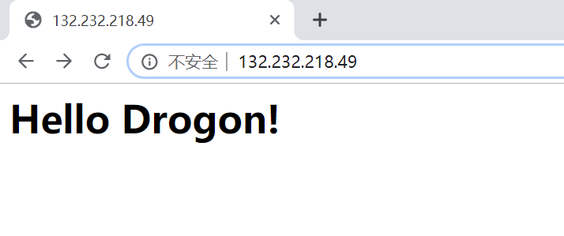
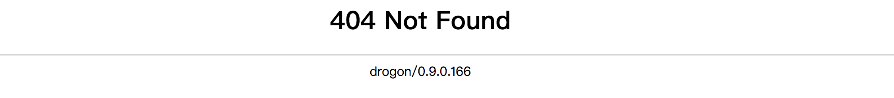

# 快速開始

[原文：ENG-03-Quick-Start.md](/ENG/ENG-03-Quick-Start.md)

## 靜態網站

先從一個簡單範例介紹 drogon 的使用方式。本例將透過命令列工具 `drogon_ctl` 建立專案：

```shell
drogon_ctl create project your_project_name
```

專案目錄中已包含多個實用資料夾：

```console
├── build                         建置資料夾
├── CMakeLists.txt                專案 cmake 設定檔
├── config.json                   Drogon 應用設定檔
├── controllers                   控制器原始碼存放資料夾
├── filters                       過濾器原始碼存放資料夾
├── main.cc                       主程式
├── models                        資料庫模型檔案資料夾
│   └── model.json
└── views                         視圖 csp 檔案資料夾
```

使用者可將各類檔案（如控制器、過濾器、視圖等）放入對應資料夾。為方便管理且減少錯誤，強烈建議使用 `drogon_ctl` 指令建立自己的 Web 應用專案。詳情請參考 [drogon_ctl](/JB_TW/ENG-12-drogon_ctl-Command.tw.md)。

來看 main.cc 檔案內容：

```c++
#include <drogon/HttpAppFramework.h>
int main() {
    //設定 HTTP 監聽位址與埠號
    drogon::app().addListener("0.0.0.0",80);
    //載入設定檔
    //drogon::app().loadConfigFile("../config.json");
    //啟動 HTTP 框架，此方法會在事件迴圈中阻塞
    drogon::app().run();
    return 0;
}
```

接著建置專案：

```shell
cd build
cmake ..
make
```

編譯完成後，執行目標檔 `./your_project_name`。

現在只要在 Http 根目錄新增一個靜態檔案 index.html：

```shell
echo '<h1>Hello Drogon!</h1>' >>index.html
```

預設根目錄為 `"./"`，可透過 config.json 修改。詳情請參考 [設定檔](/JB_TW/ENG-11-Configuration-File.tw.md)。然後即可透過網址 `"http://localhost"` 或 `"http://localhost/index.html"`（或伺服器 IP）瀏覽此頁面。



若伺服器找不到請求頁面，會回傳 404 頁面：


> **注意：請確認伺服器防火牆已開放 80 埠，否則無法瀏覽網頁。（或將埠號由 80 改為 1024 以上，避免出現以下錯誤訊息）：**

```console
FATAL Permission denied (errno=13) , Bind address failed at 0.0.0.0:80 - Socket.cc:67
```

可將靜態網站目錄與檔案複製到 Web 應用啟動目錄，即可用瀏覽器存取。drogon 預設支援的檔案類型有：

- html
- js
- css
- xml
- xsl
- txt
- svg
- ttf
- otf
- woff2
- woff
- eot
- png
- jpg
- jpeg
- gif
- bmp
- ico
- icns

drogon 也提供介面可自訂支援檔案類型，詳情請參考 [HttpAppFramework API](API-HttpAppFramework)。

## 動態網站

接下來介紹如何在應用程式中加入控制器，讓控制器回應內容。

可用 drogon_ctl 命令列工具產生控制器原始碼，於 `controllers` 資料夾執行：

```shell
drogon_ctl create controller TestCtrl
```

會新增兩個檔案：TestCtrl.h 與 TestCtrl.cc：

TestCtrl.h 範例如下：

```c++
#pragma once
#include <drogon/HttpSimpleController.h>
using namespace drogon;
class TestCtrl:public drogon::HttpSimpleController<TestCtrl>
{
public:
    virtual void asyncHandleHttpRequest(const HttpRequestPtr &req,
                                        std::function<void (const HttpResponsePtr &)> &&callback)override;
    PATH_LIST_BEGIN
    //在此定義路徑
    //PATH_ADD("/path","filter1","filter2",HttpMethod1,HttpMethod2...);
    PATH_LIST_END
};
```

TestCtrl.cc 範例如下：

```c++
#include "TestCtrl.h"
void TestCtrl::asyncHandleHttpRequest(const HttpRequestPtr &req,
                                      std::function<void (const HttpResponsePtr &)> &&callback)
{
    //在此撰寫應用邏輯
}
```

編輯這兩個檔案，讓控制器回應 "Hello World!"：

TestCtrl.h 範例如下：

```c++
#pragma once
#include <drogon/HttpSimpleController.h>
using namespace drogon;
class TestCtrl:public drogon::HttpSimpleController<TestCtrl>
{
public:
    virtual void asyncHandleHttpRequest(const HttpRequestPtr &req,
                                        std::function<void (const HttpResponsePtr &)> &&callback)override;
    PATH_LIST_BEGIN
    //在此定義路徑

    //範例
    //PATH_ADD("/path","filter1","filter2",HttpMethod1,HttpMethod2...);

    PATH_ADD("/",Get,Post);
    PATH_ADD("/test",Get);
    PATH_LIST_END
};
```

使用 PATH_ADD 將 '/' 與 '/test' 兩路徑對應至處理函式，並可加上 HTTP 方法限制。

TestCtrl.cc 範例如下：

```c++
#include "TestCtrl.h"
void TestCtrl::asyncHandleHttpRequest(const HttpRequestPtr &req,
                                      std::function<void (const HttpResponsePtr &)> &&callback)
{
    //在此撰寫應用邏輯
    auto resp=HttpResponse::newHttpResponse();
    //注意：下方 enum 常數名稱為 "k200OK"（即 200 OK），不是 "k2000K"。
    resp->setStatusCode(k200OK);
    resp->setContentTypeCode(CT_TEXT_HTML);
    resp->setBody("Hello World!");
    callback(resp);
}
```

重新以 CMake 編譯專案，執行目標檔 `./your_project_name`：

```shell
cd ../build
cmake ..
make
./your_project_name
```

於瀏覽器輸入 `"http://localhost/"` 或 `"http://localhost/test"`，即可看到 "Hello World!"。

> **注意：若伺服器同時有靜態與動態資源，drogon 會優先使用動態資源。本例中 `GET http://localhost/` 回應為 `Hello World!`（來自 `TestCtrl` 控制器），而非靜態檔案 index.html 的 `Hello Drogon!`。**

可見在應用程式中加入控制器非常簡單，只需新增對應原始碼檔案，甚至主程式檔案都不需修改。這種鬆耦合設計對 Web 應用開發非常有效。

> **注意：drogon 對控制器原始碼檔案位置沒有限制，也可放在 "./"（專案根目錄），甚至可於 `CMakeLists.txt` 定義新目錄。建議仍以 controllers 資料夾管理，方便維護。**

# 下一步: [控制器 - 簡介](ENG-04-0-Controller-Introduction.tw.md)
