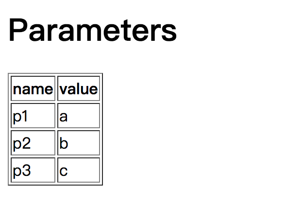

# 視圖

[原文：ENG-06-View.md](/ENG/ENG-06-View.md)

## 視圖簡介

雖然前端渲染技術盛行，後端應用服務通常只需回傳資料給前端，但好的 Web 框架仍應提供後端渲染技術，讓伺服器程式能動態產生 HTML 頁面。視圖（View）可協助使用者產生這些頁面，僅負責呈現相關工作，複雜業務邏輯則交由控制器處理。

早期 Web 應用是將 HTML 直接嵌入程式碼以動態產生頁面，但效率低且不直觀。後來如 JSP 等語言則反其道而行，將程式碼嵌入 HTML 頁面。drogon 採用後者方案，但因 C++ 需編譯執行，必須將嵌入 C++ 程式碼的頁面轉為 C++ 原始檔再編譯。因此 drogon 定義專屬 CSP（C++ Server Pages）描述語言，並用 drogon_ctl 命令列工具將 CSP 檔轉為 C++ 原始檔以供編譯。

### Drogon 的 CSP

drogon 的 CSP 解決方案很簡單，使用特殊標記將 C++ 程式碼嵌入 HTML 頁面：

- `<%inc` 與 `%>` 之間內容視為需引用的標頭檔，只能寫 `#include`，如 `<%inc#include "xx.h" %>`，但多數常用標頭檔已自動引用，通常不需用此標籤；
- `<%c++` 與 `%>` 之間內容視為 C++ 程式碼，如 `<c++ std:string name="drogon"; %>`；
- C++ 程式碼一般會原樣轉至目標原始檔，僅下列兩個特殊標籤例外：
  - `@@` 代表控制器傳入的資料變數，可取得要顯示的內容；
  - `$$` 代表頁面內容的串流物件，可用 `<<` 將內容顯示於頁面；
- `[[` 與 `]]` 之間內容視為變數名稱，視圖會以該名稱為 key 從控制器傳入資料中尋找並輸出至頁面。變數名稱前後空白會被忽略，且成對標籤須同一行。效能考量下僅支援三種字串型別（const char *、std::string、const std::string），其他型別請用上述 `$$` 方式輸出；
- `` 之間內容視為變數名稱或 C++ 表達式（非控制器資料關鍵字），視圖會輸出變數或表達式值至頁面。`` 等同 `<%c++$$<<val.xx;%>`，但前者更簡潔直觀。成對標籤勿分行；
- `<%view` 與 `%>` 之間內容視為子視圖名稱，框架會尋找對應子視圖並填入標籤位置，名稱前後空白會忽略，勿分行。可多層巢狀但不可循環巢狀；
- `<%layout` 與 `%>` 之間內容視為版型名稱，框架會尋找對應版型並將本視圖內容填入版型指定位置（版型以 `[[]]` 標記此位置），名稱前後空白會忽略，勿分行。可多層巢狀但不可循環巢狀，一個模板檔僅能繼承一個版型，不支援多重繼承。

### 視圖使用方式

drogon 應用的 http 回應由控制器 handler 產生，視圖渲染的回應也是由 handler 產生，透過下列介面呼叫：

```c++
static HttpResponsePtr newHttpViewResponse(const std::string &viewName,
                                           const HttpViewData &data);
```

此介面為 HttpResponse 類別的靜態方法，含兩個參數：

- **viewName**：視圖名稱，即 csp 檔名（副檔名可省略）；
- **data**：控制器 handler 傳給視圖的資料，型別為 `HttpViewData`，這是一種特殊 map，可儲存與取得任意型別物件，詳見 [HttpViewData API] (API-HttpViewData) 說明。

控制器無需引用視圖標頭檔，兩者高度解耦，唯一連結即資料變數。

### 簡單範例

以下製作一個顯示瀏覽器送來 HTTP 請求參數的 html 頁面。

本例直接用 HttpAppFramework 介面定義 handler，在主程式 run() 前加入：

```c++
drogon::HttpAppFramework::instance()
        .registerHandler("/list_para",
                        [=](const HttpRequestPtr &req,
                            std::function<void (const HttpResponsePtr &)> &&callback)
                        {
                            auto para=req->getParameters();
                            HttpViewData data;
                            data.insert("title","ListParameters");
                            data.insert("parameters",para);
                            auto resp=HttpResponse::newHttpViewResponse("ListParameters.csp",data);
                            callback(resp);
                        });
```

上述程式碼於 `/list_para` 路徑註冊 lambda handler，將請求參數傳給視圖顯示。

接著至 views 資料夾建立 ListParameters.csp，內容如下：

```html
<!DOCTYPE html>
<html>
<%c++
    auto para=@@.get<std::unordered_map<std::string,std::string,utils::internal::SafeStringHash>>("parameters");
%>
<head>
    <meta charset="UTF-8">
    <title>[[ title ]]</title>
</head>
<body>
    <%c++ if(para.size()>0){%>
    <H1>Parameters</H1>
    <table border="1">
      <tr>
        <th>name</th>
        <th>value</th>
      </tr>
      <%c++ for(auto iter:para){%>
      <tr>
        <td></td>
        <td><%c++ $$<<iter.second;%></td>
      </tr>
      <%c++}%>
    </table>
    <%c++ }else{%>
    <H1>no parameter</H1>
    <%c++}%>
</body>
</html>
```

可用 `drogon_ctl` 工具將 ListParameters.csp 轉為 C++ 原始檔：

```shell
drogon_ctl create view ListParameters.csp
```

執行後會產生 ListParameters.h 與 ListParameters.cc，可編譯進 Web 應用。

以 CMake 重新編譯專案，執行目標程式 webapp，於瀏覽器輸入 `http://localhost/list_para?p1=a&p2=b&p3=c`，即可看到下列頁面：



後端渲染的 html 頁面就這樣產生了。

### csp 檔自動化處理

**注意：若專案是用 `drogon_ctl` 建立，以下步驟會自動由 `drogon_ctl` 處理。**

顯然每次修改 csp 檔都手動執行 drogon_ctl 太不方便，可將 drogon_ctl 處理流程寫入 CMakeLists.txt。仍以前例為例，假設所有 csp 檔都放在 views 資料夾，CMakeLists.txt 可加上：

```cmake
FILE(GLOB SCP_LIST ${CMAKE_CURRENT_SOURCE_DIR}/views/*.csp)
foreach(cspFile ${SCP_LIST})
  message(STATUS "cspFile:" ${cspFile})
  execute_process(COMMAND basename ARGS "-s .csp ${cspFile}" OUTPUT_VARIABLE classname)
  message(STATUS "view classname:" ${classname})
  add_custom_command(
    OUTPUT ${classname}.h ${classname}.cc
    COMMAND drogon_ctl ARGS create view ${cspFile}
    DEPENDS ${cspFile}
    VERBATIM)
  set(VIEWSRC ${VIEWSRC} ${classname}.cc)
endforeach()
```

然後於 add_executable 加入新檔案集 ${VIEWSRC}：

```cmake
Add_executable(webapp ${SRC_DIR} ${VIEWSRC})
```

### 視圖動態編譯與載入

drogon 提供於應用執行期間動態編譯與載入 csp 檔的方式，介面如下：

```c++
void enableDynamicViewsLoading(const std::vector<std::string> &libPaths);
```

此介面為 `HttpAppFramework` 成員方法，參數為 csp 檔所在目錄字串陣列。呼叫後 drogon 會自動搜尋這些目錄的 csp 檔，發現新檔或有修改時會自動產生原始檔、編譯成動態庫並載入應用，無需重啟。可自行實驗並觀察 csp 檔修改後頁面變化。

此功能依賴開發環境，若 drogon 與 webapp 都在本機編譯，動態載入 csp 頁面應無問題。

> **注意：動態視圖不可靜態編譯進應用，若已靜態編譯則無法用動態載入更新。可於開發時將視圖移至編譯目錄外的資料夾。**

> **注意：此功能建議僅於開發階段調整 HTML 頁面，正式環境建議直接編譯 csp 檔進目標檔，主要考量安全與穩定性。**

> **注意：若載入動態視圖時出現 `symbol not found` 錯誤，請用 `cmake .. -DCMAKE_ENABLE_EXPORTS=on` 設定專案，或取消註解 CMakeLists.txt 最後一行（`set_property(TARGET ${PROJECT_NAME} PROPERTY ENABLE_EXPORTS ON)`），再重新編譯。**

## 下一步: [會話](/JB_TW/ENG-07-Session.tw.md)
