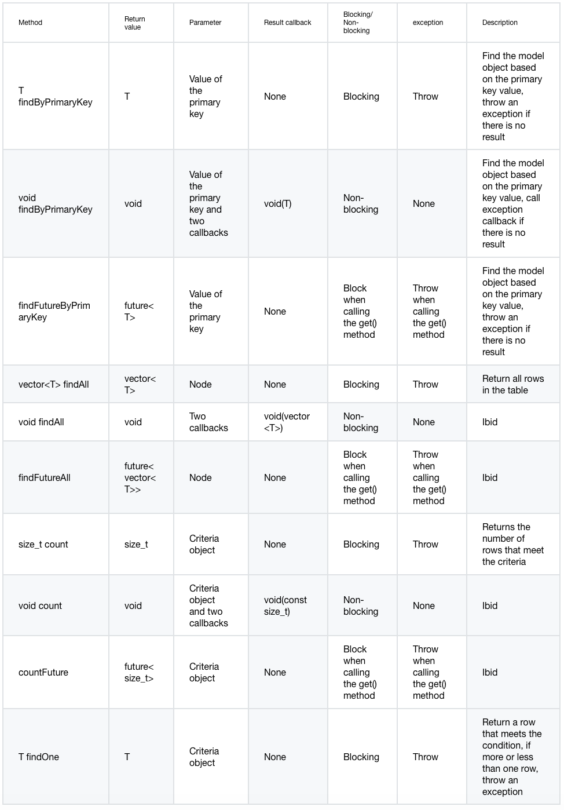
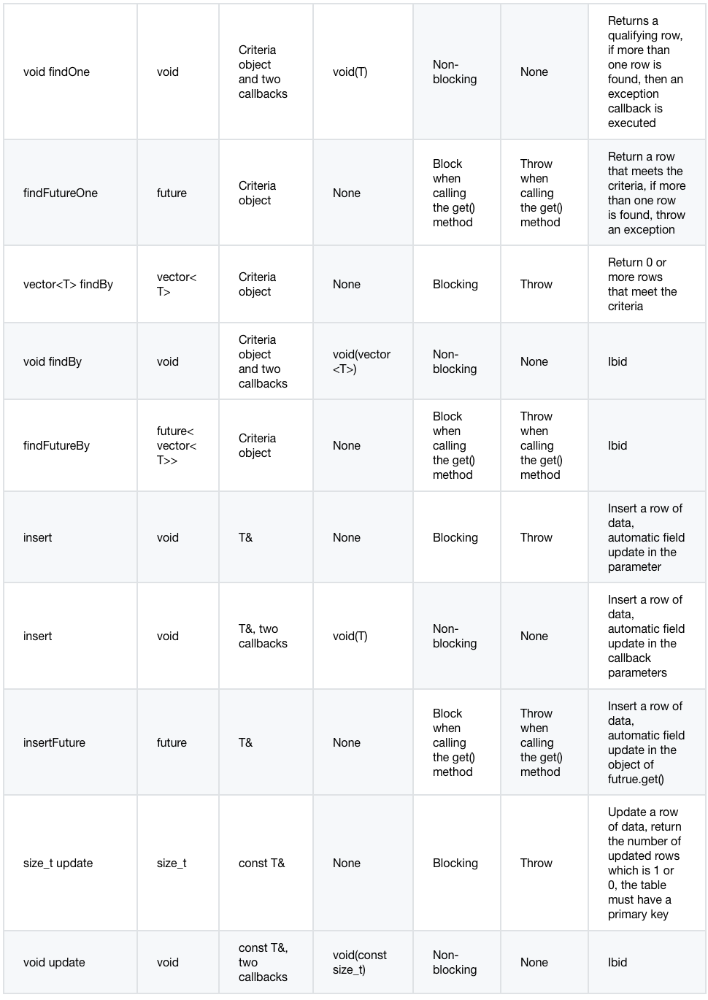
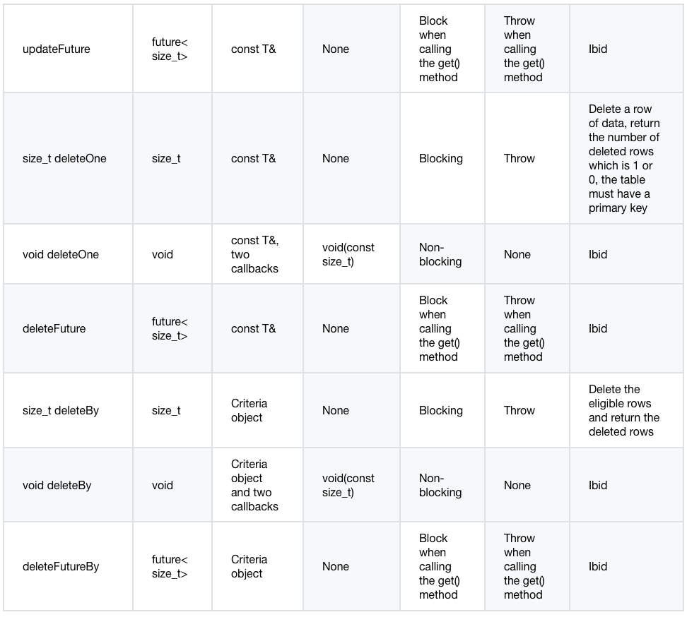

## 資料庫 - ORM

[原文：ENG-08-3-Database-ORM.md](/ENG/ENG-08-3-Database-ORM.md)

### Model（模型）

使用 Drogon ORM 時，首先需建立模型類別。Drogon 的指令工具 drogon_ctl 可自動產生模型類別，會根據使用者指定的資料庫讀取資料表資訊，並自動產生多個模型類別的原始碼檔案。使用模型時，請 include 對應的標頭檔。

每個 Model 類別對應一個資料表，Model 類別的實例則對應資料表的一筆紀錄。

建立模型類別的指令如下：

```shell
drogon_ctl create model <model_path>
```

最後一個參數是模型類別儲存路徑。該路徑下必須有 model.json 設定檔，內容為 drogon_ctl 連線資料庫的參數，格式為 JSON 並支援註解。範例如下：

```json
{
  "rdbms": "postgresql",
  "host": "127.0.0.1",
  "port": 5432,
  "dbname": "test",
  "user": "test",
  "passwd": "",
  "tables": [],
  "relationships": {
      "enabled": false,
      "items": []
  }
}
```

設定參數與應用程式設定檔相同，詳見[設定檔](/JB_TW/ENG-11-Configuration-File.tw.md#db_clients)。

`tables` 為模型設定獨有選項，為字串陣列，每個字串代表要轉換為模型類別的資料表名稱。若此選項為空，則所有資料表都會產生模型類別。

專案目錄（由 `drogon_ctl create project` 指令建立）已預先建立 models 目錄及對應 model.json，使用者可編輯設定檔並用 drogon_ctl 指令建立模型類別。

### Model 類別介面

主要有兩種使用者直接操作的介面：getter（取得）與 setter（設定）。

getter 介面分為兩種：

- `getColumnName`：取得欄位的智慧指標，回傳指標而非值，主要用於判斷欄位是否為 NULL。
- `getValueOfColumnName`：取得欄位值，為效率回傳常數參考。若欄位為 NULL，則回傳函式參數指定的預設值。

此外，二進位區塊型別（blob, bytea）有特殊介面 `getValueOfColumnNameAsString`，會將二進位資料載入 std::string 並回傳。

setter 介面用於設定欄位值，型式為 `setColumnName`，參數型別與欄位型別相符。自動產生的欄位（如自增主鍵）不會有 setter 介面。

toJson() 介面可將模型物件轉換為 JSON 物件，二進位型別會以 base64 編碼。

Model 類別的靜態成員代表資料表資訊，例如可透過 `Cols` 靜態成員取得各欄位名稱，方便在支援自動提示的編輯器使用。

### Mapper 類別模板

模型物件與資料表的映射由 Mapper 類別模板負責。Mapper 類別模板封裝了新增、刪除、修改等常用操作，讓使用者無需撰寫 SQL 即可操作資料。

Mapper 物件建構非常簡單，模板參數為要存取的模型型別，建構子僅有一個參數，即前述 DbClient 的智慧指標。Transaction 類別為 DbClient 子類別，因此也可用交易的智慧指標建構 Mapper，代表 Mapper 也支援交易。

Mapper 與 DbClient 一樣，提供非同步與同步介面。同步介面會阻塞且可能丟出例外，回傳的 future 物件在 get() 時阻塞且可能丟出例外。一般非同步介面不會丟出例外，而是透過結果 callback 與例外 callback 回傳結果。例外 callback 型別與 DbClient 介面相同。結果 callback 依介面功能分為多種，列表如下（T 為模板參數，即模型型別）：





> **注意：使用交易時，例外不一定會導致回滾。以下情況交易不會自動回滾：findByPrimaryKey 未找到合格列、findOne 找到少於或多於一筆紀錄時，Mapper 會丟出 UnexpectedRows 例外或進入例外 callback。若業務邏輯需回滾，請明確呼叫 rollback() 介面。**

### Criteria（條件物件）

許多介面需輸入 criteria 物件參數。criteria 物件為 Criteria 類別實例，表示某種條件，如欄位大於、等於、小於某值，或 is Null 等。

```c++
template <typename T>
Criteria(const std::string &colName, const CompareOperator &opera, T &&arg)
```

criteria 物件建構非常簡單，第一個參數為欄位名稱，第二個為比較型態的列舉值，第三個為比較值。若型態為 IsNull 或 IsNotNull，則不需第三個參數。

範例：

```c++
Criteria("user_id",CompareOperator::EQ,1);
```

上述例子表示 user_id 欄位等於 1。實務上更常寫成：

```c++
Criteria(Users::Cols::_user_id,CompareOperator::EQ,1);
```

此寫法可用編輯器自動提示，較有效率且不易出錯。

Criteria 類別也支援自訂 where 條件與自訂建構子：

```c++
template <typename... Arguments>
explicit Criteria(const CustomSql &sql, Arguments &&...args)
```

第一個參數為帶有 `$?` placeholder 的 CustomSql 物件，CustomSql 類別僅為 std::string 包裝。第二個不定參數為綁定參數，與 [execSqlAsync](/JB_TW/ENG-08-1-Database-DbClient.tw.md#execSqlAsync) 相同。

範例：

```c++
Criteria(CustomSql("tags @> $?"), "cloud");
```

CustomSql 類別也有字串常值語法，建議寫成：

```c++
Criteria("tags @> $?"_sql, "cloud");
```

Criteria 物件支援 AND 與 OR 運算，兩個 criteria 相加可建構新條件，方便組合巢狀條件。例如：

```c++
Mapper<Users> mp(dbClientPtr);
auto users = mp.findBy(
(Criteria(Users::Cols::_user_name,CompareOperator::Like,"%Smith")&&Criteria(Users::Cols::_gender,CompareOperator::EQ,0))
||(Criteria(Users::Cols::_user_name,CompareOperator::Like,"%Johnson")&&Criteria(Users::Cols::_gender,CompareOperator::EQ,1))
));
```

上述程式會查詢 users 資料表中所有名為 Smith 的男性或名為 Johnson 的女性。

### Mapper 鏈式介面

Mapper 類別模板也支援常見 SQL 約束（如 limit、offset），以鏈式介面提供，使用者可串接多個約束。執行任一 10.5.3 節介面後，這些約束即被清除，僅於單次操作有效：

```c++
Mapper<Users> mp(dbClientPtr);
auto users = mp.orderBy(Users::Cols::_join_time).limit(25).offset(0).findAll();
```

此程式會從 users 資料表選取使用者列表，回傳第一頁 25 筆。

鏈式介面名稱即其功能，詳情請參考 Mapper.h 標頭檔。

### Convert（轉換層）

`convert` 為模型設定獨有選項，於資料庫讀寫前後加上轉換層。物件包含 `enabled` 布林值（是否啟用），`items` 陣列包含：

- `table`：欄位所屬資料表
- `column`：欄位名稱
- `method`：物件
  - `after_db_read`：讀取後呼叫的方法名稱，簽名：void([const] std::shared_ptr<`type`> [&])
  - `before_db_write`：寫入前呼叫的方法名稱，簽名：void([const] std::shared_ptr<`type`> [&])
- `includes`：字串陣列，include 檔名（加 " 或 < >）

### Relationships（關聯）

資料表間關聯可透過 model.json 的 `relationships` 設定。採手動設定而非自動偵測外鍵，因實務專案常不使用外鍵。

若 `enable` 為 true，產生的模型類別會依設定加入對應介面。

關聯分三種：has one（一對一）、has many（一對多）、many to many（多對多）。

- #### has one（一對一）

  一對一關聯，原始表一筆紀錄可關聯目標表一筆紀錄，反之亦然。例如 products 與 skus 表一對一，可設定如下：

  ```json
  {
    "type": "has one",
    "original_table_name": "products",
    "original_table_alias": "product",
    "original_key": "id",
    "target_table_name": "skus",
    "target_table_alias": "SKU",
    "target_key": "product_id",
    "enable_reverse": true
  }
  ```

  各欄位意義同上，若 enable_reverse 為 true，則目標表模型類別也會加入反向關聯介面。

  依此設定，products 表模型類別會加入：

  ```c++
      /// Relationship interfaces
      void getSKU(const DbClientPtr &clientPtr,
                  const std::function<void(Skus)> &rcb,
                  const ExceptionCallback &ecb) const;
  ```

  這是非同步介面，會在 callback 回傳與目前 product 關聯的 SKU 物件。

  skus 表模型類別則會加入：

  ```c++
      /// Relationship interfaces
      void getProduct(const DbClientPtr &clientPtr,
                      const std::function<void(Products)> &rcb,
                      const ExceptionCallback &ecb) const;
  ```

- #### has many（一對多）

  一對多關聯，目標表通常有欄位與原始表主鍵關聯。例如 products 與 reviews 一對多，可設定如下：

  ```json
  {
    "type": "has many",
    "original_table_name": "products",
    "original_table_alias": "product",
    "original_key": "id",
    "target_table_name": "reviews",
    "target_table_alias": "",
    "target_key": "product_id",
    "enable_reverse": true
  }
  ```

  依此設定，products 表模型類別會加入：

  ```c++
      void getReviews(const DbClientPtr &clientPtr,
                      const std::function<void(std::vector<Reviews>)> &rcb,
                      const ExceptionCallback &ecb) const;
  ```

  reviews 表模型類別則會加入：

  ```c++
      void getProduct(const DbClientPtr &clientPtr,
                      const std::function<void(Products)> &rcb,
                      const ExceptionCallback &ecb) const;
  ```

- #### many to many（多對多）

  多對多關聯通常需中介表，每筆中介表紀錄對應原始表與目標表各一筆。例如 products 與 carts 多對多，可設定如下：

  ```json
  {
    "type": "many to many",
    "original_table_name": "products",
    "original_table_alias": "",
    "original_key": "id",
    "pivot_table": {
      "table_name": "carts_products",
      "original_key": "product_id",
      "target_key": "cart_id"
    },
    "target_table_name": "carts",
    "target_table_alias": "",
    "target_key": "id",
    "enable_reverse": true
  }
  ```

  依此設定，products 表模型類別會加入：

  ```c++
      void getCarts(const DbClientPtr &clientPtr,
                    const std::function<void(std::vector<std::pair<Carts,CartsProducts>>)> &rcb,
                    const ExceptionCallback &ecb) const;
  ```

  carts 表模型類別則會加入：

  ```c++
      void getProducts(const DbClientPtr &clientPtr,
                      const std::function<void(std::vector<std::pair<Products,CartsProducts>>)> &rcb,
                      const ExceptionCallback &ecb) const;
  ```

### Restful API 控制器

drogon_ctl 也可在建立模型時自動產生每個模型（資料表）對應的 restful 風格控制器，讓使用者零程式碼即可產生增刪改查 API。這些 API 支援主鍵查詢、條件查詢、欄位排序、指定欄位回傳、欄位別名等功能，並可隱藏資料表結構。由 model.json 的 `restful_api_controllers` 選項控制，詳細請參考 json 檔註解。

每個資料表的控制器設計為基底類別加子類別。基底類別與資料表緊密關聯，子類別則用於實作特殊業務邏輯或修改介面格式。此設計可在資料表結構變更時只更新基底類別而不覆蓋子類別（設定 `generate_base_only` 為 true）。

## 下一步: [FastDbClient](/JB_TW/ENG-08-4-Database-FastDbClient.tw.md)
