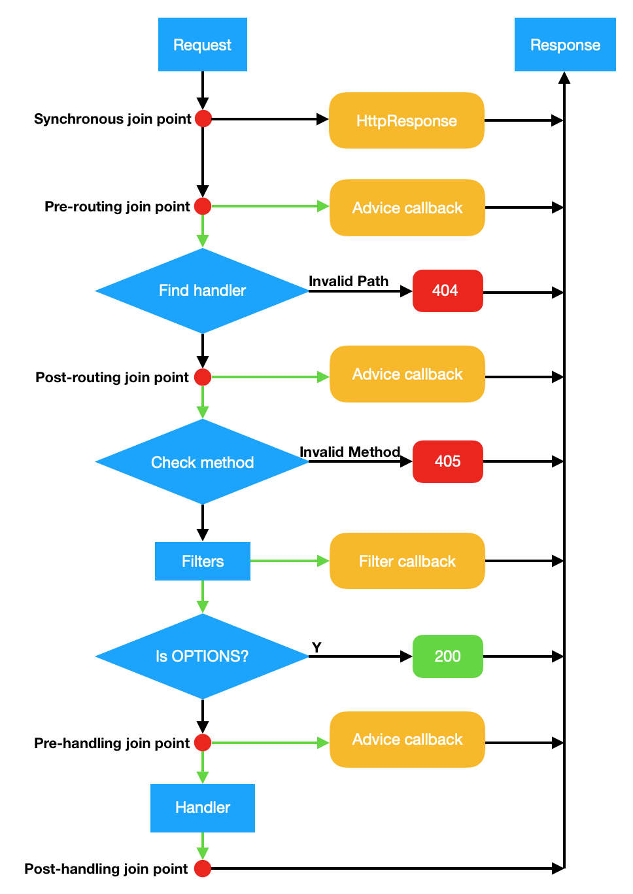

## 面向切面程式設計（AOP）

[原文：ENG-13-AOP-Aspect-Oriented-Programming.md](/ENG/ENG-13-AOP-Aspect-Oriented-Programming.md)

AOP（面向切面程式設計，Aspect Oriented Programming）是一種程式設計範式，目的是將橫切關注點（cross-cutting concerns）模組化（引自維基百科）。

受限於 C++ 語言特性，Drogon 並未如 Spring 提供彈性 AOP 解決方案，而是內建一組預定義的 joinpoint，使用者可透過框架的 AOP 介面將處理器（在 Drogon 稱為 advice）註冊到特定 joinpoint。

### 預定義 joinpoint

Drogon 提供七個 joinpoint。當應用執行至 joinpoint 時，會依序呼叫使用者註冊的 advice。各 joinpoint 說明如下：

- Beginning：於程式啟動時執行。即 app().run() 初始化完成後，所有 controller、filter、plugin、資料庫 client 均已建立，使用者可在此取得物件參照或執行初始化。此 advice 僅執行一次，簽名為 `void()`，註冊介面為 `registerBeginningAdvice`。

- NewConnection：每建立一個新的 TCP 連線時呼叫。簽名為 `bool(const trantor::InetAddress &, const trantor::InetAddress &)`，第一參數為遠端位址，第二為本地位址。回傳 false 則斷線。註冊介面為 `registerNewConnectionAdvice`。

- HttpResponseCreation：每建立一個 HTTP Response 物件時呼叫。簽名為 `void(const HttpResponsePtr &)`，參數為新建立的 Response，可統一處理所有 Response（如加 header）。此 joinpoint 影響所有 Response，包括 404 與內部錯誤，以及使用者產生的 Response。註冊介面為 `registerHttpResponseCreationAdvice`。

- Sync：位於 Http 請求處理前端。可回傳非空 Response 物件攔截請求。簽名為 `HttpRequestPtr(const HttpRequestPtr &)`。註冊介面為 `registerSyncAdvice`。

- Pre-Routing：於請求建立後、路徑比對前呼叫。advice 有兩種簽名：`void(const HttpRequestPtr &,AdviceCallback &&,AdviceChainCallback &&)` 及 `void(const HttpRequestPtr &)`，前者與 filter 的 `doFilter` 相同，可攔截或放行請求；後者無攔截功能但效能較佳，僅需統一處理時可用。註冊介面為 `registerPreRoutingAdvice`。

- Post-Routing：於請求路徑比對後立即呼叫，advice 簽名同上。註冊介面為 `registerPostRoutingAdvice`。

- Pre-Handling：於所有 filter 通過後、handler 執行前呼叫，advice 簽名同上。註冊介面為 `registerPostRoutingAdvice`。

- Post-Handling：handler 執行完畢、產生 Response 後呼叫。簽名為 `void(const HttpRequestPtr &, const HttpResponsePtr &)`，註冊介面為 `registerPostHandlingAdvice`。

### AOP 示意圖

下圖顯示上述四個 joinpoint 在 HTTP 請求處理流程中的位置，紅點為 joinpoint，綠箭頭為非同步呼叫。

## 下一步: [效能測試](/JB_TW/ENG-14-Benchmarks.tw.md)
