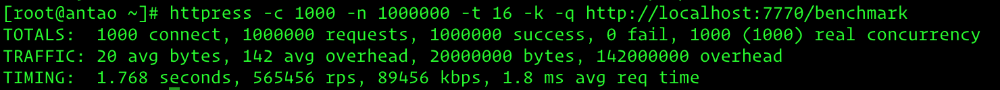

## 效能測試

[原文：ENG-14-Benchmarks.md](/ENG/ENG-14-Benchmarks.md)

作為 C++ Http 應用框架，效能理應是重點之一。本章介紹 Drogon 的簡易測試與成果。

### 測試環境

* 系統：Linux CentOS 7.4
* 設備：Dell 伺服器，CPU 為兩顆 Intel(R) Xeon(R) E5-2670 @ 2.60GHz，16 核心 32 執行緒
* 記憶體：64GB
* gcc 版本：7.3.0

### 測試方案與結果

僅測 Drogon 框架效能，故盡量簡化 controller 處理。僅建立一個 HttpSimpleController，註冊於 `/benchmark` 路徑，回傳 `<p>Hello, world!</p>`。Drogon 執行緒數設為 16。處理函式如下，原始碼可見於 `drogon/examples/benchmark`：

```c++
void BenchmarkCtrl::asyncHandleHttpRequest(const HttpRequestPtr &req, std::function<void (const HttpResponsePtr &)> &&callback)
{
    // 實作應用邏輯
    auto resp = HttpResponse::newHttpResponse();
    resp->setBody("<p>Hello, world!</p>");
    resp->setExpiredTime(0);
    callback(resp);
}
```

為比較，選用 nginx 進行測試，撰寫 `hello_world_module` 並以 nginx 原始碼編譯，worker_processes 設為 16。

測試工具為 `httpress`，一款高效能 HTTP 壓力測試工具。

調整 httpress 參數，每組參數測五次，記錄每秒處理請求數最大值與最小值。結果如下：

| 指令行                                   | 說明                                               | Drogon(kQPS) | nginx(kQPS) |
| :--------------------------------------- | :------------------------------------------------- | :----------: | :---------: |
| httpress -c 100 -n 1000000 -t 16 -k -q URL   | 100 連線，100 萬請求，16 執行緒，Keep-Alive      |   561/552    |   330/329   |
| httpress -c 100 -n 1000000 -t 12 -q URL      | 100 連線，100 萬請求，12 執行緒，無 Keep-Alive  |   140/135    |    31/49    |
| httpress -c 1000 -n 1000000 -t 16 -k -q URL  | 1000 連線，100 萬請求，16 執行緒，Keep-Alive     |   573/565    |   333/327   |
| httpress -c 1000 -n 1000000 -t 16 -q URL     | 1000 連線，100 萬請求，16 執行緒，無 Keep-Alive  |   155/143    |    52/50    |
| httpress -c 10000 -n 4000000 -t 16 -k -q URL | 10000 連線，400 萬請求，16 執行緒，Keep-Alive    |   512/508    |   316/314   |
| httpress -c 10000 -n 1000000 -t 16 -q URL    | 10000 連線，100 萬請求，16 執行緒，無 Keep-Alive |   143/141    |    43/40    |

可見於 client 端啟用 Keep-Alive 時，drogon 可於單一連線多次請求下處理超過 50 萬次/秒，表現相當優異。若每次請求都建立新連線，CPU 時間多花於 TCP 連線建立與斷線，吞吐量降至 14 萬次/秒，屬合理範圍。

以上測試 Drogon 明顯優於 nginx。如有更精確測試，歡迎指正。

下圖為測試截圖：



## 下一步: [Coz 因果分析](/JB_TW/ENG-15-Coz.tw.md)
